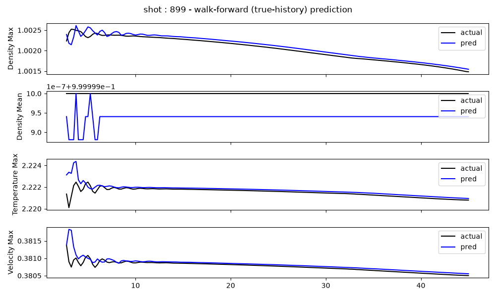
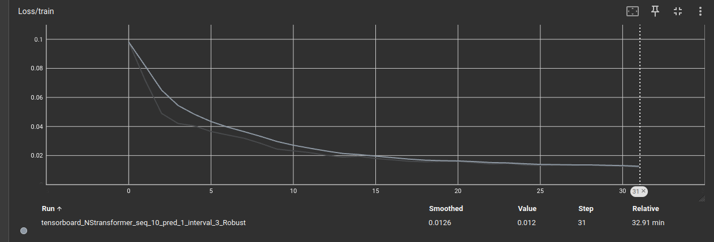
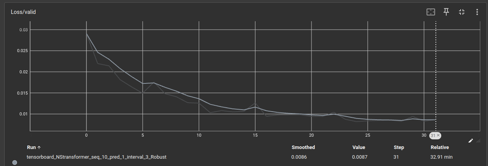

This project is based on understanding the phenomenon of plasma physics, particularly XVx case. What i intend to to develop the model based on Non-Stationary Transformer and DDPG Reinforcement learning. NS-Transformer behaves like an agent which provides future time step prediction particularly on Krook amplitude given all the condition at time step( such as n, u, T, W, A, k) . Which RL takes as action, and investigated the best policy by learning optimum control. Here, I just developed the architecture based on ZINZINBIN model [ZINZINBIN Model](https://github.com/ZINZINBIN/Tokamak-Plasma-Operation-Control-based-on-RL/tree/main). Look forward to share all the results in recent time.
So far, on different dataset, the prediction and actual are matching quite well. Now, what i need is to generate lots of data for NS_Transformer case to run. Currently, i run with dataset of only 18,000.
Here are the result:

