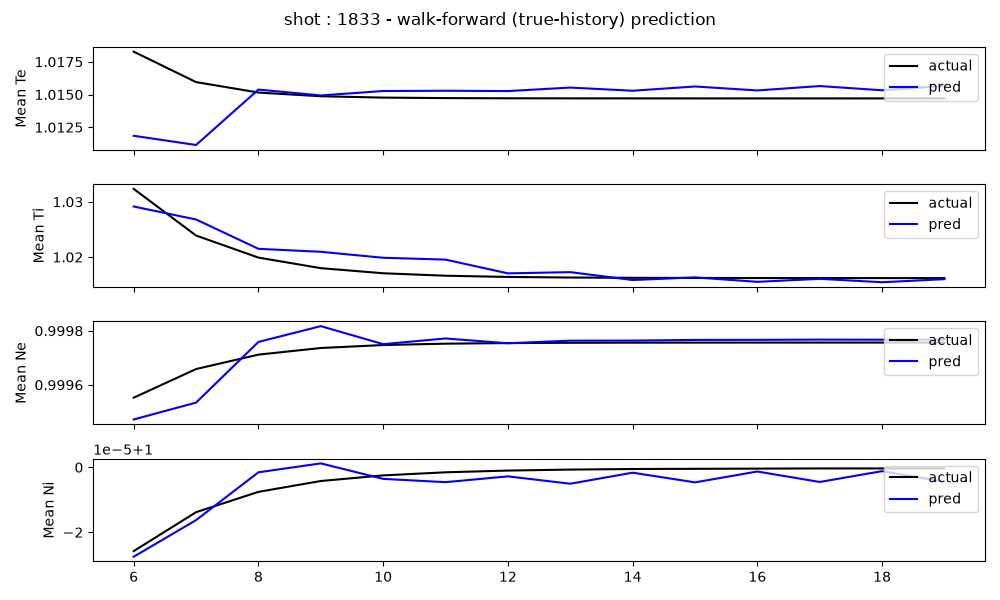
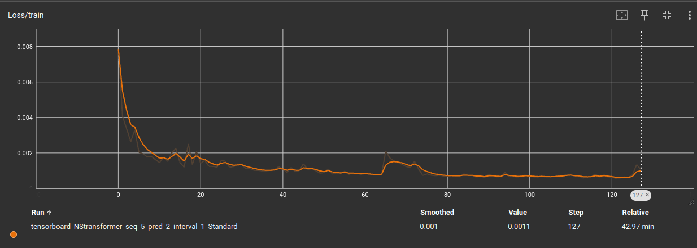
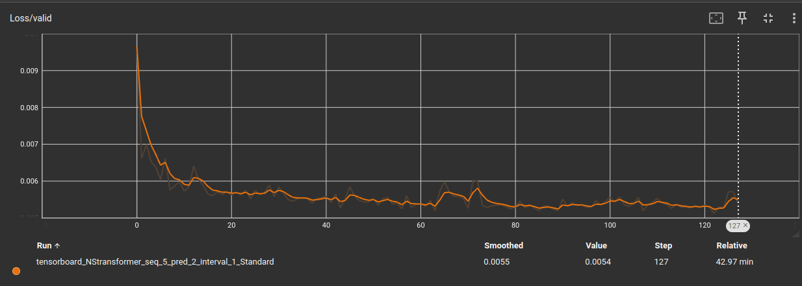

This project is based on the understanding phenomena of plasma physics, particularly XVx case. What i intend to develop the model based on Non-Stationary Transformer and DDPG Reinforcement learning which behaves like an agent. The NS-Transformer serves as a learned dynamics model, predicting the plasma's next state (T_e, T_i, N_e, N_i) given the current state and a control action. The DDPG agent uses this learned model as a fast environment proxy, selecting actions and receiving rewards based on how well the resulting state matches the target, iteratively optimizing its policy. From this we can control the characteristics of plasma.  the architecture based on ZINZINBIN model [ZINZINBIN Model](https://github.com/ZINZINBIN/Tokamak-Plasma-Operation-Control-based-on-RL/tree/main). Look forward to share all the results in recent time.
The dataset are provided in `master_trajectory_dataset.csv`. Next step would be to add mean v_e, v_i to include in state.  

So far the results are :
training process finished, best loss : 0.005, best epoch : 122
| mse : 0.001 | rmse : 0.019 | mae : 0.007 | r2-score : 0.999

I need to work on r2-score, that seems problematic to me. 

Here are the result:

Currently, a larger dataset generating in my University lab computer, will update later when i find good results.

